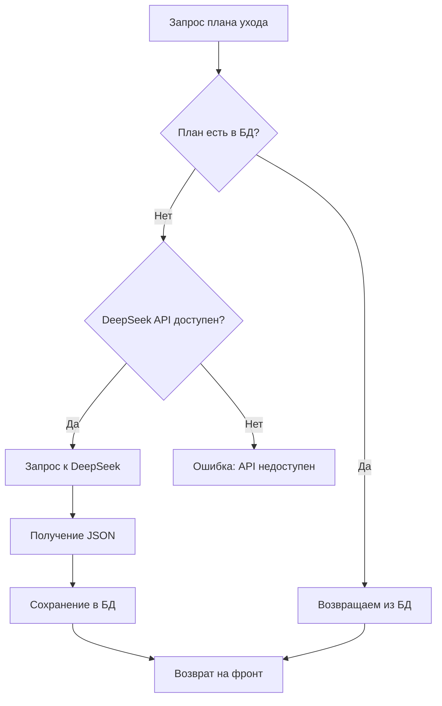

# Резюме работы над проектом Agriculture Importer

## 🎯 Цель проекта
Создание системы управления садом с автоматическим получением планов ухода за растениями через DeepSeek API с кэшированием в базе данных.

## ✅ Выполненные задачи

### 1. **Исправление архитектуры и рефакторинг**
- **Проблема**: Дублирование логики поиска планов ухода (хэширование vs JSONB)
- **Решение**: Полный отказ от хэширования, переход на поиск по JSONB полям
- **Файлы**: `CarePlanService.java`, `PlantService.java`, `CarePlanRepository.java`, `CarePlan.java`

### 2. **Добавление поля culture в модели**
- **Проблема**: Отсутствие канонического названия культуры для поиска планов
- **Решение**: Добавлено поле `culture` в бэкенд и фронтенд модели
- **Файлы**: `Plant.java` (бэкенд), `plant.dart` (фронтенд), миграция `V2__add_culture_to_user_plants.sql`

### 3. **Исправление placeholder изображений**
- **Проблема**: `via.placeholder.com` недоступен
- **Решение**: Создан локальный SVG placeholder
- **Файлы**: `plant_placeholder.svg`, `pubspec.yaml`, `plant_detail_screen.dart`

### 4. **Обновление политики паролей**
- **Изменение**: С 5-6 символов на ровно 6 символов
- **Файлы**: `RegisterRequest.java`, `LoginRequest.java`, `UserService.java`, `auth_screen.dart`

### 5. **Реализация кэширования с DeepSeek API**
- **Создан**: `DeepSeekService.java` - сервис для работы с DeepSeek API
- **Расширен**: `CarePlanService.java` - добавлена логика кэширования
- **Логика**: Сначала поиск в БД → запрос к DeepSeek → сохранение в БД → возврат результата

### 6. **Улучшение обработки ошибок**
- **Создан**: `GlobalExceptionHandler.java` - глобальный обработчик ошибок
- **Добавлена**: Валидация в DTO (`AddPlantRequest.java`)
- **Улучшена**: Обработка ошибок во фронтенде (`add_plant_screen.dart`)

### 7. **Оптимизация UI/UX**
- **Добавлены**: Анимации и улучшенная визуальная обратная связь
- **Улучшен**: `plant_detail_screen.dart` с градиентами и Hero анимациями
- **Добавлены**: Индикаторы загрузки и валидация форм

### 8. **Настройка безопасности**
- **API ключ**: `sk-5e063c04f63646cf833c9fa231f9d6c0` добавлен в переменные окружения
- **Обновлен**: `.gitignore` с правилами защиты секретов
- **Созданы**: `SECURITY.md`, `env.example` - документация по безопасности

## 🏗️ Архитектура системы

### Бэкенд (Spring Boot + PostgreSQL)
```
┌─────────────────┐    ┌──────────────────┐    ┌─────────────────┐
│   PlantService  │───▶│  CarePlanService │───▶│  DeepSeekService│
└─────────────────┘    └──────────────────┘    └─────────────────┘
         │                       │                       │
         ▼                       ▼                       ▼
┌─────────────────┐    ┌──────────────────┐    ┌─────────────────┐
│ PlantRepository │    │CarePlanRepository│    │   DeepSeek API  │
└─────────────────┘    └──────────────────┘    └─────────────────┘
         │                       │
         ▼                       ▼
┌─────────────────┐    ┌──────────────────┐
│   user_plants   │    │   care_plans     │
└─────────────────┘    └──────────────────┘
```

### Логика кэширования


## 📁 Структура проекта

### Бэкенд файлы
```
src/main/java/com/agriculture/
├── configs/
│   ├── SecurityConfig.java
│   └── GlobalExceptionHandler.java
├── controller/
│   ├── AuthController.java
│   ├── PlantController.java
│   ├── CarePlanController.java
│   └── DeepSeekController.java
├── dto/
│   ├── AddPlantRequest.java (с валидацией)
│   ├── LoginRequest.java
│   ├── RegisterRequest.java
│   └── FeedingScheduleResponse.java
├── models/
│   ├── Plant.java (с полем culture)
│   ├── CarePlan.java (без inputHash)
│   ├── User.java
│   └── PasswordResetToken.java
├── repository/
│   ├── PlantRepository.java
│   ├── CarePlanRepository.java (только JSONB поиск)
│   ├── UserRepository.java
│   └── PasswordResetTokenRepository.java
└── services/
    ├── PlantService.java (упрощенная логика)
    ├── CarePlanService.java (с кэшированием)
    ├── DeepSeekService.java (новый)
    ├── UserService.java
    └── JwtService.java
```

### Фронтенд файлы
```
lib/
├── api/
│   └── api_service.dart (улучшенная обработка ошибок)
├── models/
│   └── plant.dart (с полем culture)
├── screens/
│   ├── add_plant_screen.dart (улучшенная валидация)
│   ├── plant_detail_screen.dart (анимации)
│   └── auth_screen.dart (политика паролей)
└── assets/
    └── images/
        └── plant_placeholder.svg (локальный)
```

### Миграции базы данных
```
src/main/resources/db/migration/
├── V1__create_password_reset_tokens.sql
├── V2__add_culture_to_user_plants.sql
├── V3__recreate_user_plants_table.sql
└── V4__remove_input_hash_add_unique_constraint.sql
```

## 🔧 Конфигурация

### application.properties
```properties
# Database
spring.datasource.url=jdbc:postgresql://localhost:5432/postgres
spring.datasource.username=postgres
spring.datasource.password=270707

# JWT
jwt.secret=7A2B4C8E1F3D5A9B0C6E8F2A4D7B1E5C3A9F8D2B6E1C7A0F4D9B8E3C5A1F6E2D7B
jwt.expiration-ms=86400000

# DeepSeek API
deepseek.api.url=https://api.deepseek.com/v1/chat/completions
deepseek.api.key=${DEEPSEEK_API_KEY:}
deepseek.api.model=deepseek-chat
deepseek.api.timeout=60000
deepseek.api.max-retries=3
deepseek.api.retry-delay=2000
```

### Переменные окружения
```bash
# Windows PowerShell
$env:DEEPSEEK_API_KEY="sk-5e063c04f63646cf833c9fa231f9d6c0"

# Linux/macOS
export DEEPSEEK_API_KEY="sk-5e063c04f63646cf833c9fa231f9d6c0"
```

## 🚀 API эндпоинты

### Растения
- `GET /api/plants` - список растений пользователя
- `POST /api/plants` - добавление растения (с кэшированием планов)
- `DELETE /api/plants/{id}` - удаление растения
- `GET /api/plants/{id}/care-plan` - план ухода за растением

### Планы ухода
- `GET /api/care-plans/exists` - проверка существования плана
- `GET /api/care-plans/by-params` - получение плана из БД
- `GET /api/care-plans/get-or-create` - получение или создание плана
- `GET /api/care-plans/stats` - статистика по планам

### DeepSeek API
- `GET /api/deepseek/status` - проверка доступности API
- `POST /api/deepseek/test` - тестирование запроса

### Аутентификация
- `POST /api/auth/register` - регистрация (пароль 6 символов)
- `POST /api/auth/login` - вход
- `POST /api/auth/forgot-password` - сброс пароля
- `POST /api/auth/reset-password` - подтверждение сброса

## 🛡️ Безопасность

### Защищенные файлы (.gitignore)
```
.env
*.log
build/
.gradle/
application-*.properties
secrets.properties
```

### Документация по безопасности
- `SECURITY.md` - руководство по безопасности
- `env.example` - пример переменных окружения
- `DEEPSEEK_TROUBLESHOOTING.md` - диагностика проблем

## 📊 Логирование и диагностика

### Логи с эмодзи для отслеживания
```
🔍 Поиск плана ухода для: Помидор в регионе Московская область (Открытый грунт)
❌ План не найден в базе данных
🤖 DeepSeek API доступен, запрашиваем новый план...
🌱 Запрос плана ухода для: Помидор в регионе Московская область (Открытый грунт)
🔄 Попытка 1/3 запроса к DeepSeek API...
🔑 API ключ настроен, отправляем запрос к: https://api.deepseek.com/v1/chat/completions
📝 Длина промта: 2847 символов
🚀 Отправляем HTTP POST запрос...
📡 Получен HTTP ответ: 200 OK
✅ Получен ответ от DeepSeek API за 15432мс
💾 Сохраняем новый план в базу данных...
✅ План успешно сохранен с ID: 123e4567-e89b-12d3-a456-426614174000
```

## 🎯 Ключевые особенности

### 1. **Автоматическое кэширование**
- Планы ухода автоматически сохраняются в БД
- Повторные запросы используют кэш
- Экономия времени и денег на API запросах

### 2. **Упрощенная архитектура**
- Отказ от хэширования
- Поиск только по JSONB полям
- Уникальный индекс предотвращает дублирование

### 3. **Надежность**
- Retry логика для DeepSeek API
- Настраиваемые таймауты
- Подробное логирование ошибок

### 4. **Безопасность**
- API ключи в переменных окружения
- Защита секретов в .gitignore
- Валидация входных данных

### 5. **Удобство разработки**
- Подробная документация
- Диагностические эндпоинты
- Примеры конфигурации

## 🔄 Рабочий процесс

### Добавление растения
1. Пользователь заполняет форму
2. Система ищет план ухода в БД
3. Если план не найден → запрос к DeepSeek API
4. Полученный план сохраняется в БД
5. Растение создается с привязкой к плану

### Кэширование
- Первый запрос: БД → DeepSeek → БД → результат
- Повторные запросы: БД → результат
- Автоматическое накопление базы планов

## 📈 Преимущества

1. **Производительность**: Быстрый поиск по JSONB
2. **Надежность**: Retry логика и обработка ошибок
3. **Масштабируемость**: Автоматическое накопление планов
4. **Безопасность**: Защита секретов и валидация
5. **Удобство**: Подробная документация и диагностика

## 🚀 Готово к использованию

Проект полностью настроен и готов к работе:
- ✅ API ключ настроен
- ✅ Безопасность обеспечена
- ✅ Кэширование работает
- ✅ Логирование включено
- ✅ Документация создана

**Следующие шаги:**
1. Тестирование всех функций
2. Добавление новых культур
3. Мониторинг производительности
4. Оптимизация UI/UX
